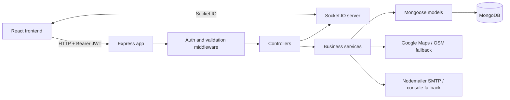
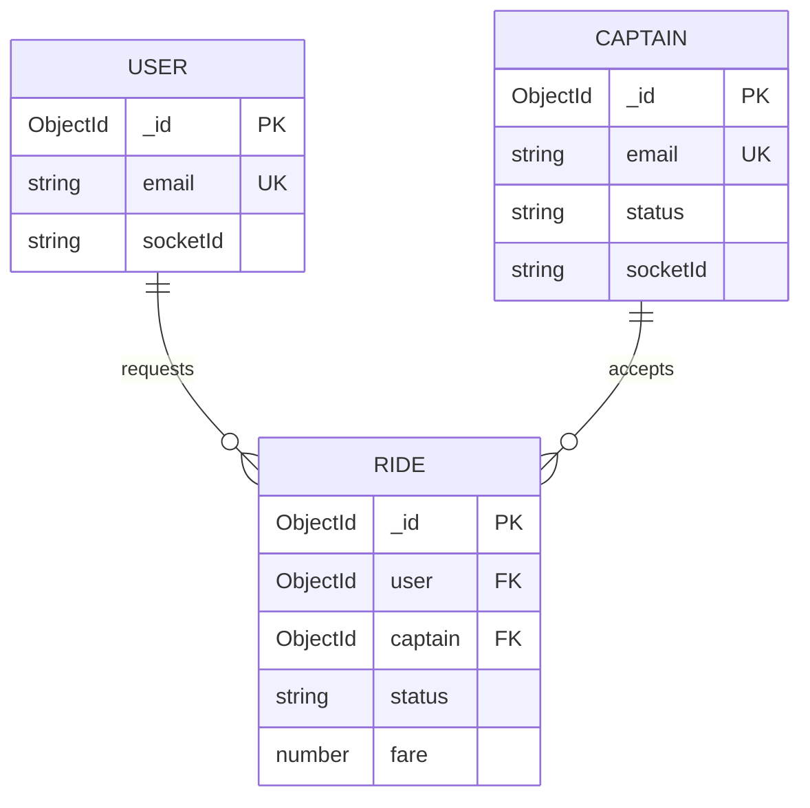
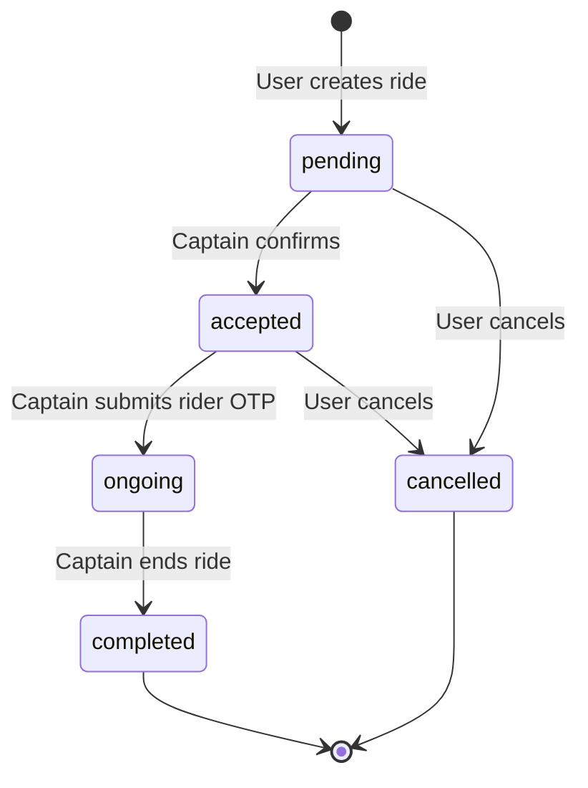

# RideX Uber Clone Backend Documentation

This document describes the implemented backend and its integration with the React frontend. It is based on the source currently in `Backend/` and `frontend/src/`; examples and caveats below reflect the current code rather than an idealized production design.

## 1. Project Overview

RideX is a MERN ride-hailing application with two roles:

- **User/rider**: creates an account, searches locations, estimates a fare, requests a ride, receives captain updates, confirms cash payment, and tracks the ride.
- **Captain/driver**: creates an account with vehicle details, broadcasts location, receives ride requests, accepts a ride, verifies the rider OTP, receives payment confirmation, and completes the ride.

The backend combines:

- Express HTTP APIs for authentication, maps, fares, and ride state changes.
- MongoDB with Mongoose for users, captains, rides, and revoked JWTs.
- Socket.IO for live ride notifications, captain location updates, and payment notifications.
- Google Maps APIs when configured, with OpenStreetMap and deterministic local fallbacks.
- Nodemailer SMTP for password reset email, with console OTP simulation when SMTP is not configured.

## 2. Architecture



### Backend entry points

| File | Responsibility |
|---|---|
| `Backend/server.js` | Creates the HTTP server, initializes Socket.IO, and listens on `PORT` or `3000`. |
| `Backend/app.js` | Loads environment variables, connects to MongoDB per request, registers Express middleware, health check, and route prefixes. |
| `Backend/api/index.js` | Exports the Express app for Vercel serverless deployment. |
| `Backend/socket.js` | Registers Socket.IO connection handlers and sends targeted events. |
| `Backend/db/db.js` | Maintains a cached Mongoose connection using `MONGODB_URI`. |

### Request pipeline

1. `dotenv` loads `Backend/.env`.
2. The database middleware attempts to establish a cached MongoDB connection.
3. CORS, JSON/form parsing, and cookie parsing are applied.
4. The request is routed under `/users`, `/captains`, `/maps`, or `/rides`.
5. `express-validator` checks request fields where configured.
6. `authUser` or `authCaptain` reads a cookie or bearer token, checks the blacklist, verifies the JWT, and attaches `req.user` or `req.captain`.
7. The controller invokes a service or model operation and returns JSON.

## 3. Installation and Configuration

### Backend

```bash
cd Backend
npm install
npm run dev
```

Use `npm start` for `node server.js` without Nodemon. The backend listens on `http://localhost:3000` by default.

### Environment variables

Create `Backend/.env`:

```env
PORT=3000
MONGODB_URI=mongodb+srv://<user>:<password>@<cluster>/<database>
JWT_SECRET=<long-random-secret>
GOOGLE_MAPS_API=<google-maps-server-key>

SMTP_HOST=smtp.gmail.com
SMTP_PORT=587
SMTP_USER=<sender-email>
SMTP_PASS=<smtp-password-or-app-password>
SMTP_FROM="RideX Support" <sender-email>
```

Create `frontend/.env`:

```env
VITE_BASE_URL=http://localhost:3000
```

`VITE_BASE_URL` is used for Axios requests and as the Socket.IO connection URL.

### Deployment

`Backend/vercel.json` maps every request to `Backend/api/index.js` using `@vercel/node`. Configure the same backend environment variables in the deployment provider. The regular `server.js` process is required for a persistent Socket.IO server; serverless deployments may require a deployment architecture that supports long-lived WebSocket connections.

## 4. Database Schema

Mongoose timestamps are enabled only on the ride schema. Passwords and password-reset fields are hidden by default with `select: false`.

### `users` collection

Model: `Backend/models/user.model.js`, Mongoose model name: `user`.

| Field | Type | Rules / purpose |
|---|---|---|
| `_id` | ObjectId | MongoDB primary key. |
| `fullname.firstname` | String | Required; minimum 3 characters. |
| `fullname.lastname` | String | Optional; minimum 3 characters when supplied. |
| `email` | String | Required, unique; controller normalizes to lowercase and trims. |
| `password` | String | Required, `select: false`; stored as bcrypt hash. |
| `socketId` | String | Current Socket.IO connection ID used for targeted events. |
| `resetOtp` | String | Hidden by default; six-digit password-reset OTP. |
| `resetOtpExpires` | Date | Hidden by default; reset OTP expiry time. |

Methods/statics:

- `generateAuthToken()` signs `{ _id }` with `JWT_SECRET` for 24 hours.
- `comparePassword(password)` verifies a plaintext password with bcrypt.
- `hashPassword(password)` creates a bcrypt hash using cost 10.

### `captains` collection

Model: `Backend/models/captain.model.js`, Mongoose model name: `captain`.

| Field | Type | Rules / purpose |
|---|---|---|
| `_id` | ObjectId | MongoDB primary key. |
| `fullname.firstname` | String | Required; minimum 3 characters. |
| `fullname.lastname` | String | Optional; minimum 3 characters when supplied. |
| `email` | String | Required, unique, lowercase, email format. |
| `password` | String | Required, `select: false`; stored as bcrypt hash. |
| `socketId` | String | Current Socket.IO connection ID. |
| `resetOtp` | String | Hidden by default; six-digit reset OTP. |
| `resetOtpExpires` | Date | Hidden by default; reset OTP expiry time. |
| `status` | String | `active` or `inactive`; defaults to `inactive`. Login/register set it to `active`; logout sets it to `inactive`. |
| `vehicle.color` | String | Required; minimum 3 characters. |
| `vehicle.plate` | String | Required; minimum 3 characters. |
| `vehicle.capacity` | Number | Required; minimum 1. |
| `vehicle.vehicleType` | String | Required; enum: `car`, `motorcycle`, `auto`. |
| `location.ltd` | Number | Last latitude sent by captain. Note the field is spelled `ltd` in the implementation. |
| `location.lng` | Number | Last longitude sent by captain. |

The captain model has the same token, password comparison, and hashing methods as the user model.

### `rides` collection

Model: `Backend/models/ride.model.js`, Mongoose model name: `ride`.

| Field | Type | Rules / purpose |
|---|---|---|
| `_id` | ObjectId | MongoDB primary key. |
| `user` | ObjectId | Required reference to `user`. |
| `captain` | ObjectId | Optional reference to `captain`; populated after acceptance. |
| `pickup` | String | Required address. |
| `destination` | String | Required address. |
| `fare` | Number | Required calculated fare. |
| `status` | String | Enum: `pending`, `accepted`, `ongoing`, `completed`, `cancelled`; defaults to `pending`. |
| `duration` | Number | Estimated duration in seconds. |
| `distance` | Number | Estimated distance in meters. |
| `paymentID` | String | Reserved payment provider field; not currently used by the cash flow. |
| `orderId` | String | Reserved payment provider field; not currently used. |
| `signature` | String | Reserved payment verification field; not currently used. |
| `otp` | String | Required, hidden by default; six-digit captain start code. |
| `completedAt` | Date | Set when the captain completes the ride. |
| `createdAt`, `updatedAt` | Date | Automatically maintained by Mongoose timestamps. |

### `blacklisttokens` collection

Model: `Backend/models/blackListToken.model.js`, Mongoose model name: `BlacklistToken`.

| Field | Type | Rules / purpose |
|---|---|---|
| `token` | String | Required and unique; revoked JWT. |
| `createdAt` | Date | Defaults to current time and expires after 86,400 seconds through MongoDB TTL. |

### Entity relationships



## 5. Authentication and Authorization

Both roles use JWTs with a 24-hour expiration. The token contains the account `_id` and is signed with `JWT_SECRET`.

Accepted token locations:

1. `token` cookie.
2. `Authorization: Bearer <token>` header.

`Backend/middlewares/auth.middleware.js` checks the token against `BlacklistToken` before verifying it. A valid user token attaches the database user to `req.user`; a valid captain token attaches the captain to `req.captain`.

The frontend stores the returned token in `localStorage` and sends it as a bearer token. It also stores `role` as either `user` or `captain` for client-side redirects. Protected React wrappers call `/users/profile` or `/captains/profile` before rendering protected pages.

## 6. HTTP API Reference

The backend health endpoint is:

```http
GET /
```

Response: `Uber Clone API is active and running`.

### User endpoints

All paths below are relative to the backend base URL.

| Method and path | Auth | Request | Behavior |
|---|---|---|---|
| `POST /users/register` | No | JSON: `fullname.firstname`, optional `fullname.lastname`, `email`, `password` | Validates fields, lowercases email, rejects duplicate email, hashes password, creates user, returns `201 { token, user }`. |
| `POST /users/login` | No | JSON: `email`, `password` | Validates credentials, sets `token` cookie, returns `200 { token, user }`. |
| `GET /users/profile` | User | None | Returns the authenticated user as JSON. |
| `POST /users/forgot-password` | No | JSON: `email` | Generates a six-digit OTP, stores it for 15 minutes, and sends/simulates an email. |
| `POST /users/reset-password` | No | JSON: `email`, `otp`, `newPassword` | Validates OTP and expiry, hashes the new password, clears reset fields. |

Validation errors generally return `400 { errors: [...] }`. Invalid credentials return `401`.

### Captain endpoints

| Method and path | Auth | Request | Behavior |
|---|---|---|---|
| `POST /captains/register` | No | JSON: `fullname`, `email`, `password`, and `vehicle: { color, plate, capacity, vehicleType }` | Validates fields, creates captain, marks status `active`, returns `201 { token, captain }`. |
| `POST /captains/login` | No | JSON: `email`, `password` | Validates credentials, marks status `active`, sets cookie, returns `200 { token, captain }`. |
| `GET /captains/profile` | Captain | None | Returns `200 { captain }`. |
| `GET /captains/logout` | Captain | None | Marks captain `inactive`, blacklists token, clears cookie, returns success message. |
| `POST /captains/forgot-password` | No | JSON: `email` | Stores a six-digit OTP for 15 minutes and sends/simulates reset email. |
| `POST /captains/reset-password` | No | JSON: `email`, `otp`, `newPassword` | Validates OTP, hashes password, clears OTP fields, and marks captain `active`. |

### Map endpoints

All map endpoints require a user token and use query parameters.

| Method and path | Query | Behavior |
|---|---|---|
| `GET /maps/get-coordinates` | `address` | Returns `{ ltd, lng }`. |
| `GET /maps/get-distance-time` | `origin`, `destination` | Returns `{ distance: { value, text }, duration: { value, text } }`. Values are meters and seconds. |
| `GET /maps/get-suggestions` | `input` | Returns an array of address strings. Inputs shorter than the validator threshold are rejected. |

Map provider order:

1. Google Geocoding, Distance Matrix, or Places Autocomplete when `GOOGLE_MAPS_API` is present and responds successfully.
2. OpenStreetMap Nominatim for geocoding and suggestions.
3. Deterministic Delhi-area coordinates for geocoding fallback.
4. A synthetic distance/time result or sample Indian locations as the final fallback.

### Ride endpoints

| Method and path | Auth | Request | Behavior |
|---|---|---|---|
| `GET /rides/get-fare` | User | Query: `pickup`, `destination` | Calls the map service and returns fare estimates for `auto`, `car`, and `moto`. |
| `POST /rides/create` | User | JSON: `pickup`, `destination`, `vehicleType` | Calculates distance, duration, fare, and OTP; creates a pending ride; notifies nearby captains with `new-ride`; returns the ride. |
| `POST /rides/confirm` | Captain | JSON: `rideId` | Assigns the captain, changes status to `accepted`, populates user/captain, and emits `ride-confirmed` to the user. |
| `GET /rides/start-ride` | Captain | Query: `rideId`, `otp` | Requires an accepted ride and matching six-digit OTP; changes status to `ongoing`; emits `ride-started` to the user. |
| `POST /rides/end-ride` | Captain | JSON: `rideId` | Requires that captain and status `ongoing`; changes status to `completed`, sets `completedAt`, and emits `ride-ended` to the user. |
| `GET /rides/captain-stats` | Captain | None | Returns today's and lifetime ride counts and earnings. |
| `GET /rides/pending` | Captain | None | Returns the newest pending ride, populated with user data. Used as polling recovery for missed socket requests. |
| `POST /rides/cancel` | User | JSON: `rideId` | Allows cancellation while `pending` or `accepted` for the requesting user; notifies an assigned captain with `ride-cancelled`. |
| `GET /rides/user-active-ride` | User | None | Returns the newest pending/accepted/ongoing ride from the last 12 hours, including OTP, or `null`. |

Most controller/service errors return `500 { message }`; validation failures return `400` and authentication failures return `401`.

### Fare calculation

`Backend/services/ride.service.js` calls the distance service and calculates each vehicle fare as:

```text
fare = round(baseFare + (distanceKm * perKmRate) + (durationMinutes * perMinuteRate))
```

| Vehicle key | Base fare | Per km | Per minute |
|---|---:|---:|---:|
| `auto` | 30 | 10 | 2 |
| `car` | 50 | 15 | 3 |
| `moto` | 20 | 8 | 1.5 |

Ride creation stores the fare for the requested `vehicleType`, plus distance in meters and duration in seconds.

## 7. Socket.IO Protocol

The frontend connects to `VITE_BASE_URL`. A client identifies its role after connecting:

```js
socket.emit('join', { userId, userType: 'user' | 'captain' })
```

The server stores the socket ID on the corresponding user or captain document. The frontend re-emits `join` after reconnecting.

### Client-to-server events

| Event | Payload | Effect |
|---|---|---|
| `join` | `{ userId, userType }` | Associates the current socket with a user or captain. |
| `update-location-captain` | `{ userId, location: { ltd, lng } }` | Updates the captain location in MongoDB. Captain UI sends this approximately every 10 seconds. |
| `payment-made` | `{ captainId, rideId }` | Finds the captain socket and emits `payment-received` to that captain. |

### Server-to-client events

| Event | Recipient | Payload / effect |
|---|---|---|
| `new-ride` | Captains returned by the radius lookup | Ride populated with its user; opens the captain request popup. |
| `ride-confirmed` | Requesting user | Accepted ride with populated captain; opens the waiting-for-driver state. |
| `ride-started` | User | Ride data; navigates the user to the riding screen. |
| `payment-received` | Assigned captain | `{ rideId, paid: true }`; displays payment alert and opens finish panel. |
| `ride-ended` | User | Completed ride notification; returns user to home. |
| `ride-cancelled` | Assigned captain | `{ rideId }`; closes matching captain popup. |
| `error` | Socket that sent invalid location | `{ message: 'Invalid location data' }`. |

Socket.IO currently permits all origins with `origin: '*'` and `GET`/`POST` methods. Authentication is not performed during the socket handshake; the client identifies itself with the `join` event.

## 8. Complete Ride Workflow



1. The rider enters pickup and destination. The frontend requests suggestions and a fare estimate.
2. The rider selects a vehicle and posts `/rides/create`.
3. The backend calculates route metrics, creates a pending ride with a hidden six-digit OTP, and returns the ride immediately.
4. The backend geocodes pickup, searches for captains within a 2 km spherical radius, and sends `new-ride` to captains with stored socket IDs. The OTP is blanked on the notification copy.
5. The captain can receive the request through Socket.IO or discover the newest pending ride through `/rides/pending` polling.
6. The captain posts `/rides/confirm`. The backend assigns the captain, sets `accepted`, populates both parties, and sends `ride-confirmed` to the rider.
7. The rider sees the OTP from the active ride response. The captain submits it to `/rides/start-ride`. A matching OTP changes the ride to `ongoing` and emits `ride-started`.
8. The rider confirms cash payment in the UI. The frontend emits `payment-made`; this does not create a payment record or change ride status. It only sends `payment-received` to the captain.
9. The captain submits `/rides/end-ride`. The backend marks the ride `completed`, sets `completedAt`, and emits `ride-ended` to the rider.
10. Captain stats query completed and assigned rides and calculate today's values from `completedAt`.

## 9. Frontend Integration Map

| Frontend surface | Backend dependency |
|---|---|
| `Home.jsx` | Suggestions, fare, create, cancel, active-ride recovery, `ride-confirmed`, and `ride-started`. |
| `CaptainHome.jsx` | Pending ride polling, captain location socket updates, `new-ride`, `ride-cancelled`, and ride confirmation. |
| `Riding.jsx` | Active-ride recovery, `payment-made`, and `ride-ended`. |
| `CaptainRiding.jsx` | `payment-received` and finish ride UI. |
| `UserProtectWrapper.jsx` | `/users/profile`. |
| `CaptainProtectWrapper.jsx` | `/captains/profile`. |
| `ForgotPassword.jsx` | Role-dependent forgot/reset password endpoints. |
| `CaptainDetails.jsx` | `/rides/captain-stats`. |
| `SocketContext.jsx` | Socket.IO connection and reconnect behavior. |

## 10. Important Implementation Caveats

These are observations from the current source and should be resolved before treating the project as production-ready:

1. **Vehicle type mismatch**: captain registration accepts and stores `motorcycle`, while ride fare/create validation accepts `moto`. The fare table uses `moto`. A motorcycle captain and a `moto` ride can therefore use different spellings. Normalize this contract across frontend, routes, models, and fare logic.
2. **User logout route is missing**: `user.controller.js` implements `logoutUser`, but `user.routes.js` currently does not register `GET /users/logout`. The frontend calls this path, so user logout will not reach that controller until the route is mounted.
3. **Payment is notification-only**: `payment-made` does not persist `paymentID`, `orderId`, `signature`, or a paid status. It is a client-triggered cash confirmation and should not be considered payment verification.
4. **Socket identity is client-supplied**: the socket handshake is unauthenticated and `join` accepts any `userId`/`userType`. Production deployments should authenticate the socket connection and authorize location and payment events.
5. **Captain radius fallback is broad**: if geospatial lookup fails or finds no captains, `getCaptainsInTheRadius` returns all captains. This can broadcast a ride to every captain.
6. **Pending ride proximity is not filtered**: `/rides/pending` currently returns the latest pending ride; the stored captain coordinates are read, but rides do not store pickup coordinates and the final filter returns every result.
7. **Ride acceptance is not conditional**: confirmation updates by ride ID without requiring `status: 'pending'` or preventing a race between two captains.
8. **Database connection failures are swallowed**: `connectToDb` logs connection errors and the app middleware continues to the controller. A request can proceed without a usable database connection.
9. **CORS and cookie settings are broad**: HTTP CORS uses defaults and Socket.IO allows all origins. Cookies are cleared but are not configured with explicit secure, same-site, or http-only options.
10. **No automated backend tests**: the backend `test` script intentionally exits with `Error: no test specified`.
11. **No central error handler**: async controller failures are handled inconsistently, and several controllers accept a `next` argument without using it.
12. **Sensitive response review needed**: login/register responses return model objects. Passwords are normally hidden, but response shaping should still explicitly whitelist public fields.

## 11. Suggested Production Hardening

- Normalize `moto` versus `motorcycle` and add tests for every vehicle type.
- Mount and test user logout, then clear both client storage and server cookie consistently.
- Add socket JWT authentication and server-side ownership checks for every event.
- Store pickup/destination coordinates on rides and use a proper `2dsphere` index for proximity queries.
- Make acceptance atomic with a pending-status condition and handle duplicate acceptance.
- Persist payment state and verify payments through a trusted provider webhook if online payments are added.
- Use a centralized async error handler, fail fast on unavailable MongoDB, and return consistent error formats.
- Restrict CORS to known frontend origins and configure secure HTTP-only cookies for browser sessions.
- Add unit tests for fare calculation and services, integration tests for auth and ride transitions, and Socket.IO workflow tests.
- Add indexes for unique emails, ride status/created time, ride user/status, and captain location.

## 12. Directory Guide

```text
Backend/
├── app.js                    Express app and route registration
├── server.js                 HTTP and Socket.IO server startup
├── socket.js                 Real-time events and targeted messaging
├── api/index.js              Serverless app export
├── db/db.js                 MongoDB connection helper
├── middlewares/auth.middleware.js
├── routes/                   HTTP route definitions and validation
├── controllers/              HTTP request handlers
├── services/                 Fare, maps, email, user, captain, and ride logic
└── models/                   Mongoose schemas and auth methods

frontend/src/
├── pages/                    User/captain screens and route guards
├── components/               Ride panels, map, details, and reusable UI
└── context/                  User, captain, and Socket.IO state
```

## 13. Useful Commands

```bash
# Backend
cd Backend
npm install
npm run dev
npm start

# Frontend
cd frontend
npm install
npm run dev
npm run build
npm run lint
```
